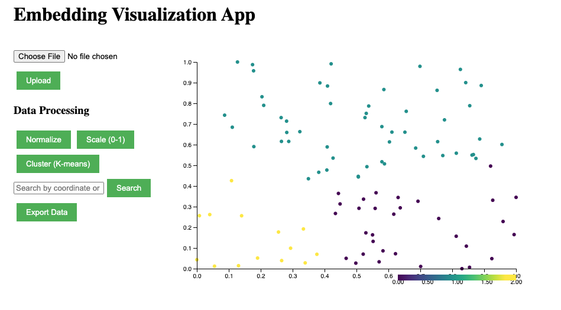

# Vector Visualization

An interactive web application for visualizing and exploring high-dimensional embeddings using advanced dimensionality reduction techniques.



## Features

- Interactive 2D visualization of high-dimensional embeddings
- File upload support for custom embedding data
- Dynamic zooming and panning capabilities
- Point selection and information display
- Data processing options (normalization, scaling)
- Data summary statistics
- SQLite database for persistent storage
- Docker support for easy deployment

## Tech Stack

- **Frontend**: React.js, D3.js
- **Backend**: Node.js, Express.js
- **Database**: SQLite
- **Build Tools**: Webpack
- **Testing**: Jest, SuperTest

## Getting Started

### Prerequisites

- Docker and Docker Compose
- Node.js (for local development)

### Running with Docker

1. Clone the repository
2. Build and start the containers:
   ```bash
   docker-compose up --build
   ```
3. Access the application at `http://localhost:5010`

### Local Development

1. Install dependencies:
   ```bash
   npm install
   ```

2. Start the development server:
   ```bash
   npm run dev
   ```

3. Access the application at `http://localhost:5010`

## Project Structure

```
VectorVisualization/
├── client/              # Frontend React application
├── server/              # Backend Express server
├── __mocks__/           # Jest mock files
├── scripts/             # Utility scripts
├── uploads/             # File upload directory
└── docker-compose.yml   # Docker configuration
```

## Documentation

- [Project Plan](plan.md)
- [Current Status](current_status.md)
- [Development Instructions](instructions.md)

## Testing

Run the test suite:

```bash
npm test
```

## Contributing

1. Create a feature branch
2. Make your changes
3. Submit a pull request

## License

This project is licensed under the MIT License.